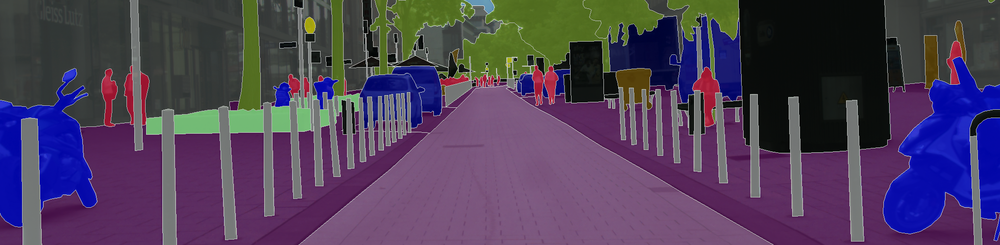

# activelearning_thesis_semseg

Reducing demand for training model for semantic segmentation using Active Learning. A great literature to start understanding [Active Learning](http://www.cs.cmu.edu/~bsettles/pub/settles.activelearning.pdf)

## Result

1. Model: VGG19 as Encoder + U-Net as Classifier: 

&nbsp;&nbsp;&nbsp;&nbsp;&nbsp;&nbsp;In this thesis, two variant of active learning methods were applied (blue and orange), and both shows improvement in information gain on the same amount of training sample allowed.

&nbsp;&nbsp;&nbsp;&nbsp;&nbsp;&nbsp; .

### Sample for inference 
Average IOU: ± 0.65 IOU using DeeplabV3 [*(link)*](https://paperswithcode.com/method/deeplabv3#:~:text=DeepLabv3%20is%20a%20semantic%20segmentation,by%20adopting%20multiple%20atrous%20rates.). The work that popularized Atrous Spatial Pyramid Pooling [*(link)*](https://arxiv.org/abs/1606.00915v2) on semantic segmentation.

.

## Dataset 

#### MNIST
Image recognition on Handwritten digits [*(link)*](http://yann.lecun.com/exdb/mnist/)

#### Cityscapes
Traffic sceneries taken in Germany [*(link)*](https://www.cityscapes-dataset.com/)

